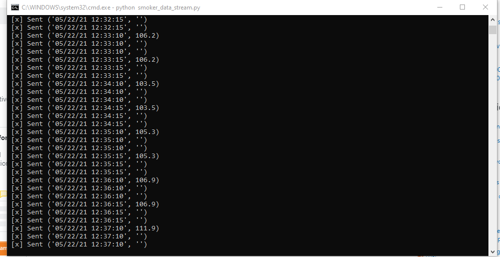
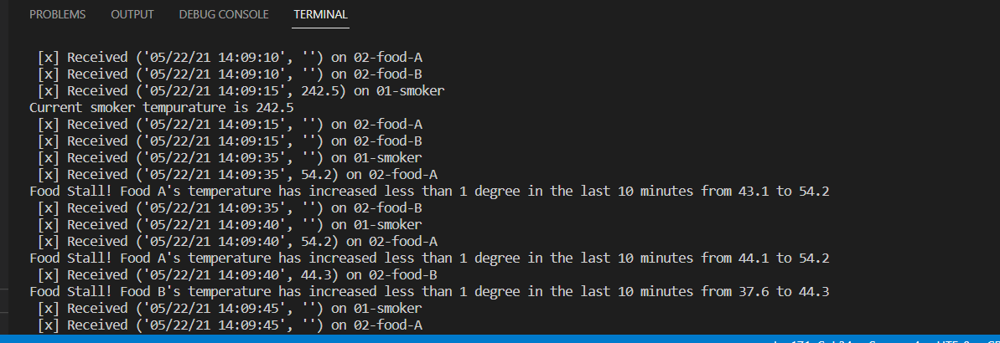
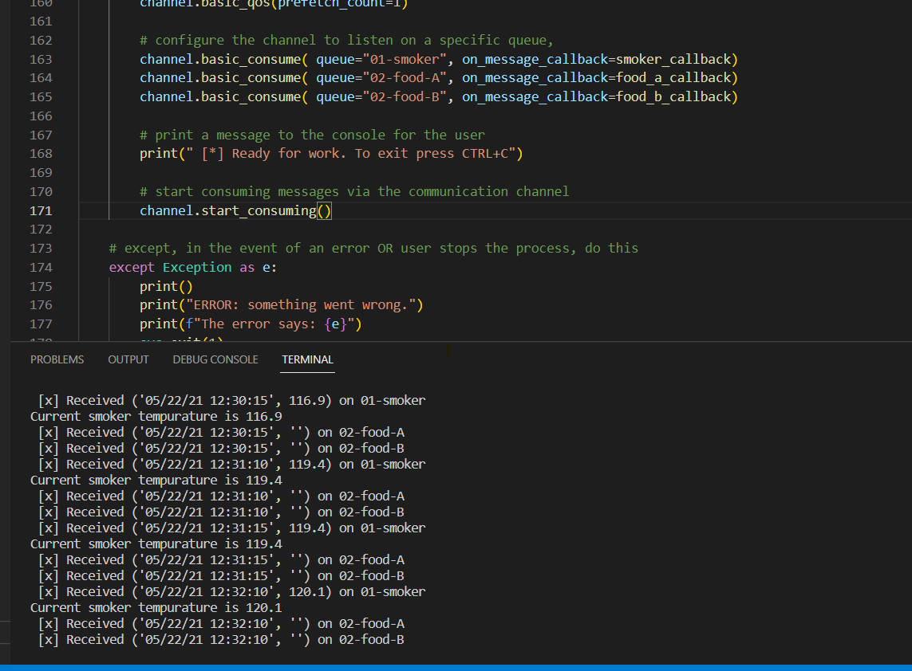

# streaming-06-smart-smoker

# Dylan Eggemeyer
February 19, 2023

## Prerequisites
* Python 3.10 or newer installed
* Ability to execute python scripts
* access to repository streaming-05-smart-smoker

## Stream Smoker Data
Run smoker_data_stream.py to simulate a stream of smoker temperature data every 30 seconds.

## Use consumer to read the data and show alerts
Run smoker_consumer.py in a new terminal as smoker_data_stream.py is running

## Screenshots
This shows the producer running and sending messages

This shows the consumer receiving the data and using to show alerts and current temperatures

